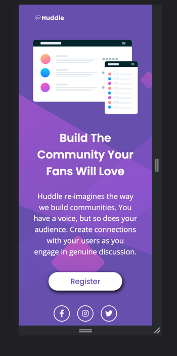

# Página inicial do Huddle usando HTML e CSS 

## Bem-vindo! 👋

Criei uma Página inicial com html e css de um desafio do Frontend Mentor.

## Meu Processo:

Usei apenas 6 horas para fazer esse desafio, começando com `html` e indo para o `css`, com o objetivo de fazer o código em `ingles`, tentando codar de uma forma simples e limpa, sendo facil de entender..

## Prints do projeto finalizado 👇

## Mobile

## Desktop

##  Agradecimento:
Obrigado por ler e me apoiar, qualquer dica e sujestão é bem vinda!